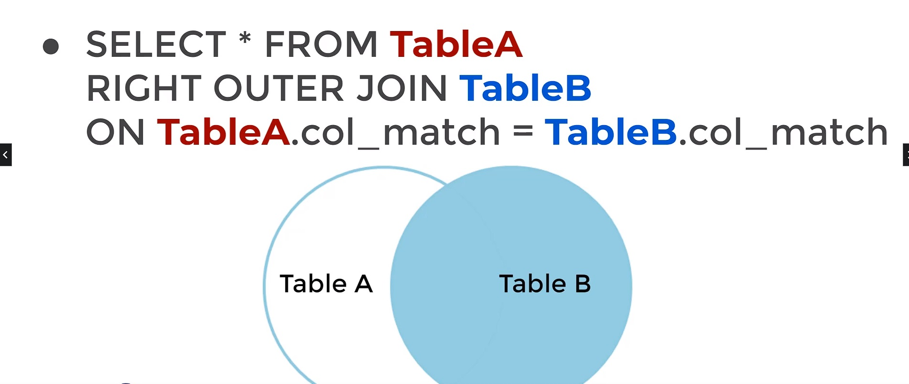

# PostgreSQL

- 무료!
- 설치 간편, 쉬움
- pgadmin 에서 query입력은 query tool에서 (우클릭하면 뜸)
- Bynury Path 설정
  [http://www.linuxdata.org/bbs/board.php?bo_table=DB&wr_id=82](http://www.linuxdata.org/bbs/board.php?bo_table=DB&wr_id=82)
- 기본구문

  

- 데이터 보는법
  Schemas > Public > tables

- 1.설치방법 (window)

  1. 구글에 PostgreSQL 검색
  2. [PostgreSQL.org](http://PostgreSQL.org) 접속
  3. Download 클릭
  4. 운영체제 확인 후, Download Installer 버튼 찾아서 클릭
  5. EDB 사이트로 이동되는데, 이떄 버전과 운영체제 확인후 클릭
  6. 설치 마법사 다운로드 → 실행
  7. 체크 전부 건들지 않고 마지막 FInish에서만 c체크해제 후 마무리

  8. 구글에 PgAdmin 검색 (pgadmin.org 접속)
  9. 아무것도 체크해제 하지 않고 전부 설치

- 2.지정한 데이터 불러오기 (Restore)
  1. Create → DataBase 생성
  2. 생성한 DB 우클릭 후 Restore 선택
  3. FileName 에 tar 파일 또는 등록 희망하는 파일 경로 입력
  4. Data 옵션에서 Pre-Data, Data, 가있는 블록의 옵션 모두 On

## Query 구문

- **SELECT**
  - 필요한 데이터를 불러오는 기본적인 방식
    SELECT \* FROM TableName
    `sql
SELECT * FROM film;
`
- **DISTINCT**
  - 중복 제거 구문
  - `SELECT DISTINCT (열이름) FROM 테이블이름;`
  ```sql
  SELECT DISTINCT (rating) FROM film;
  ```
- **COUNT**
  - 수를 셀수 있는 명령어 , 행의 갯수만 반환 한다.
    `SELECT COUNT(*) FROM payment;`
    `SELECT COUNT (DISTINCT amount) FROM payment;`
- **WHERE**

  ```sql
  SELECT column1, column2
  FROM table
  WHERE condition
  ```

  ```sql
  SELECT COUNT(*) FROM film
  WHERE rental_rate > 4 AND replacement_cost >= 19.99
  AND rating='R';

  WHERE 조건에 맞는 행의 갯수를 반환
  ```

- **ORDER BY**

  - ASC - 오름차순, DESC - 내림차순

  ```sql
  SELECT * FROM tableName
  ORDER BY column1 ASC( Or DESC);

  SELECT * FROM customer
  ORDER BY first_name ASC;

  SELECT * FROM customer
  ORDER BY store_id DESC, first_name ASC;
  ```

- **LIMIT**
  - 쿼리 구문중 제일 마지막에 등장하며, 최종적으로 몇개의 행을 표사할 것인지를 설정하는 쿼리
  ```sql
  SELECT * FROM payment
  ORDER BY payment_date DESC
  LIMIT 5;
  ```
  - payment 테이블에서 payment_date를 기준으로 내림차순 정렬 후, 5개의 행 까지만 표시
- **BETWEEN**

  - LOW <= VALUE <= HIGH 의 범위안에 있는 데이터를 구하는 명령어
  - 최대값과 최솟값 사의 값!
  - 날짜형식에도 사용 가능 (ISO8601 포맷 : 2007-01-01)

  ```sql
  /* 일반적인 BETWEEN*/
    SELECT COUNT(*) FROM payment
    WHERE amount BETWEEN 8 AND 9;

   /* date 형태의 BETWEEN*/
   SELECT * FROM payment
   WHERE payment_date BETWEEN '2007-02-01' AND '2007-02-15';
  ```

- **IN**

  - IN 명령어를 통하여 OR 연산과 같이 여러 옵션의 값들에 대한 출력을 할 수 있다.

  ```sql
  SELECT color FROM table
  WHERE color IN ('red', 'blue')

  SELECT color FROM table
  WHERE color NOT IN ('red', 'blue')
  ```

  ```sql
  /* IN 명령어 기본 사용법*/
  SELECT * FROM payment
  WHERE amount IN (0.99, 1.98, 1.99)
  ORDER BY amount; --amount 의 값이 0.99 | 1.98 | 1.99 인것들만 출력

  SELECT * FROM payment
  WHERE amount IN (0.99, 1.98, 1.99); --3321 Rows

  SELECT COUNT(*) FROM payment
  WHERE amount  NOT IN (0.99, 1.98, 1.99); --11295 Rows

  SELECT * FROM customer
  WHERE first_name IN ('John', 'Jake', 'Julie');
  ```

- **LIKE , ILIKE**

  - 문자열 데이터를 이용한 패턴 매칭 명령어
  - LIKE 는 대소문자를 구분, ILIKE 는 대소문자를 구분하지 않는다.
  - ‘%James’ 와 같이 %를 이용하여 와일드카드로 사용할 수 있다.
  - ‘%A’ = ~A
  - ‘A%’ = A~
  - ‘%A%’ = ~ A ~(A글자를 포함만 하면 True)
  - ‘\_’ (언더바) 는 1 character에 대한 매칭 값만 패턴화 할수 있다.

  ```sql
  WHERE name LIKE '%A'

  WHERE name LIKE 'A%'
  ```

  ```sql
  /* LIKE */
  /* first_name 이 J로 시작하고 last_name이 S로 시작하는 모든 항목*/
  SELECT * FROM customer
  WHERE first_name LIKE 'J%' AND last_name LIKE 'S%';
  ```

### <span style='color:#008000'>**Group By**</span>

- 데이터가 카테고리별로 어떻게 분포되어 있는지 파악하기 위해 데이터를 집계하고 함수를 적용하는 SQL 문이다.
- FROM 문 이나 WHERE 문 바로뒤에 와야 사용할 수 있다.
- Group By로 호출된 열은 SELECT 문에도 선언되어야 한다.
  (집계함수로 호출된 다른 열이 있다면, 그 열은 group by문에 호출되지 않아도 된다.)

- **집계함수**

  - 여러조건을 입력하여 하나의 결과를 반환 하는것
  - SELECT 절이나, HAVING 절에서만 호출 된다.
  - AVG, COUNT, MAX, MIN, SUM
  - 집계함수 AVG는 평균값을 산출하기 때문에 부동소수가 올수 있다.
    때문에 ROUND()와 같이 사용하여 평균산출값의 크기를 줄여서 출력할 수 있다.
  - COUNT 는 행의 개수만 반환한다.

  ```sql
  /*최소 교체비용 출력*/
  SELECT MIN(replacement_cost) FROM film;

  /*최대 교체비용 출력*/
  SELECT MAX(replacement_cost) AS max_replace_cost FROM film;

  /* 하나의 열에 대해서만 집계함수를 호출할 수 있다.*/
  -- SELECT MIN(replacement_cost), film_id FROM film; -- Error

  SELECT MIN(replacement_cost), MAX(replacement_cost)
  FROM film;

  /* 평균 구하기*/
  SELECT ROUND(AVG(replacement_cost),2) --소수 두자리수까지 반올림
  FROM film;
  ```

- **Group By 사용**

  1. 카테고리열을 선택한다.
  2. 카테고리별로 테이블을 나누어 준다.
  3. 집계함수를 이용하여 카테고리별 집계 산출 값을 출력한다.
  <p>

  - 간단한 GROUP BY 문 사용

  ```sql
  /*GROUP BY*/
  SELECT customer_id, SUM(amount) FROM payment
  GROUP BY customer_id
  ORDER BY customer_id;

  -----------------------------------------
  SELECT customer_id, staff_id, SUM(amount)
  FROM payment
  GROUP BY staff_id, customer_id
  ORDER BY customer_id, staff_id;
  ```

  - 날짜 형식 (DATE)을 이용한 GROUP BY
  - 날짜 변환 = DATE()

  ```sql
  /*날짜(DATE 형식)를 이용한 GROUP BY*/
  SELECT DATE(payment_date), SUM(amount) FROM payment
  GROUP BY DATE(payment_date)
  ORDER BY SUM(amount) DESC;
  ```

  <hr>
  <p>

- **GROUP BY 연습문제 1**

  ```sql
  /*
  가장 많은 결제를 한 직원에게 보너스를 주고싶을때 (결제 건수로 측정)
  */
  SELECT staff_id, COUNT(*) FROM payment
  GROUP BY staff_id
  ORDER BY COUNT(*);

  /*
  교체비용(replacement_cost) 과 영화의 MPAA 등급사이의 관계에대한 연구 진행중
  MPAA 등급별 평균 교체비용 등급은 무엇일까
  */

  SELECT rating, ROUND(AVG(replacement_cost),4)
  FROM film
  GROUP BY rating
  ORDER BY ROUND(AVG(replacement_cost),4) DESC;

  /*
  상위 5명의 고객에게 쿠폰을 주려고 한다. 이때 총 지출액 또는 총사용을 기준으로 상위 고객 ID는 뭘까?
  (total spend 가 기준)
  */
  SELECT customer_id, SUM(amount)
  FROM payment
  GROUP BY customer_id
  ORDER BY SUM(amount) DESC
  LIMIT 5;
  ```

  <hr>
  <p>

- **HAVING 문법**

  - 집계가 이미 수행된 !이후! 에 자료를 필터링 하기 위해 사용한다.
    GROUP BY 호출 뒤에 위치한다.

  ```sql
  /*HAVING 구문*/

  /*
  customer_id로 Grouping 한 값들 중 amount 합계가 130 이상인 것들만 출력
  */
  SELECT customer_id, SUM(amount) FROM payment
  WHERE customer_id NOT IN (184, 87, 477)
  GROUP BY customer_id
  HAVING SUM(amount) >=130
  ORDER BY SUM(amount) DESC;

  /*이용 고객의 수가 300명 초과인 점포를 찾기*/
  SELECT store_id, COUNT(customer_id) FROM customer
  GROUP BY store_id
  HAVING COUNT(customer_id) > 300;
  ```

- HAVING 연습문제

  ```sql
  /* HAVING 연습문제*/

  /*결제 거래 건수가 40 건이상인 고객에게 플래티넘 손님 칭호를 준다.*/
  SELECT customer_id, COUNT(*)
  FROM payment
  GROUP BY customer_id
  HAVING COUNT(*) >= 40
  ORDER BY COUNT(*) DESC;

  /*직원 2와의 거래에서 100달러 이상을 사용한 customer 의 id는 무엇인가*/

  SELECT customer_id, staff_id, SUM(amount)
  FROM payment
  WHERE staff_id = 2
  GROUP BY customer_id, staff_id
  HAVING SUM(amount) >= 100
  ORDER BY SUM(amount);
  ```

- 평가문제 1

  ```sql
  /* Assesment Test 1*/

  /*id가 2인 직원에게서 최소 110 달러를 쓴 customer 의 id를 찾기*/
  SELECT customer_id, staff_id, SUM(amount)
  FROM payment
  WHERE staff_id = 2
  GROUP BY customer_id, staff_id
  HAVING SUM(amount) >= 110;
  -- 187, 148

  /*'J' 로 시작하는 영화는 몇 편인가?*/
  SELECT COUNT(*) FROM film
  WHERE title LIKE 'J%';
  -- 20편

  /*이름이 'E'로 시작하는 동시에 주소 ID 가 500 미만인 고객 중, ID 번호가 가장 높은 고객은 누구?*/
  SELECT *
  FROM customer
  WHERE first_name LIKE 'E%' AND address_id < 500
  ORDER BY customer_id DESC
  LIMIT 1;
  -- Eddie Tomlin
  ```

  <hr>
  <p>

### <span style='color:#008000'>**JOINS**</span>

- 벤다이어그램으로 설명하는 JOINS
  https://blog.codinghorror.com/a-visual-explanation-of-sql-joins/
- JOINS In Wikipedia
  [https://en.wikipedia.org/wiki/Join\_(SQL)](<https://en.wikipedia.org/wiki/Join_(SQL)>)

- JOIN 의 기본적인 기능은 여러 테이블을 하나로 합치는 기능을 한다.
<hr>
<p>

- **AS 문**

  - AS는 열이나 결과에 별칭을 부여한다.
  - AS 연산자는 Query의 맨 마지막에 실행된다.
    → WHERE 연산자나 GROUP BY 호출 같은 곳에서는 AS를 사용할 수 없다는 것

  ```sql
  SELECT Column AS New_Name FROM Table1

  SELECT SUM(column) AS new_name FROM table1
  ```

  ```sql
  SELECT customer_id, SUM(amount) AS total_spent
  FROM payment
  GROUP BY customer_id

  SELECT customer_id, SUM(amount) AS total_spent
  FROM payment
  GROUP BY customer_id
  HAVING SUM(amount) > 100 --AS 문을 이용한 Column명을 사용할수는 없다.
  -- AS문은 쿼리의 맨 마지막에 할당 된다.

  SELECT customer_id, amount AS amt_col
  FROM payment
  WHERE amount > 2
  ```

  <hr>
  <p>

- **INNER JOIN (대칭)**

  ```sql
  SELECT * FROM tabel1
  INNER JOIN table2
  ON table1.col_match = table2.col_match
  ```

  

  - table1 과 table2 모두에 있는 행만 가져온다.
  <hr>

- **OUTER JOIN**
  - 결합되는 테이블 중, 한 테이블에만 표시되는 값을 처리하는 방식을 지정
  - FULL OUTER JOIN, LEFT OURTER JOIN, RIGHT OUTER JOIN

<hr>
<p>

- **FULL OUTER JOIN (대칭)**

  - WHERE 문을 사용하지 않은 FULL OUTER JOIN은 합집합으로 테이블을 출력한다.

  ```sql
  SELECT * FROM table1
  FULL OUTER JOIN table2
  ON table1.col_match = table2.col_match
  ```

  

  

  - WHERE 문을 사용한 FULL OUTER JOIN 문은 두 테이블의 {교집합의 여집합} 으로 표현 될 수 있다.

  

<hr>
<p>

- <span style='color:#008000'>**LEFT OUTER JOIN** </span>

  - 왼쪽 테이블에 있는 레코드 세트를 결과로 출력한다.
  - 오른쪽 테이블에 일치하는 내용이 없으면 결과는 Null 이다.
  
  <p>

  - table A 만 있거나, tableA 와 tableB에 함께 존재하는 행만 반환
  
  <p>

  - Left Table 에 만 존재하는 행 구하기 (Right 테이블이 Null 인것을 구하면 된다.)
    

<hr>
<p>

- **RIGHT OUTER JOIN**

  - LEFT OUTER JOIN 과 출력 테이블의 방향만 다르다.
  - LEFT OUTER JOIN 에서 쓰이는 테이블을 서로 바꾼것과 같다.
    
  - table B 에만 있거나 table B와 table A 에 모두 존재 하는 행을 반환
    

<hr>
<p>

- **UNION**
  - 2개 이상의 SELECT 문을 결합 할 수 있다.
  - 때문에 서로의 바로 위에 결과를 쌓을 수 있도록 **열이 일치해야한다.**
  ```sql
  SELECT column1 FROM table1
  UNION
  SELECT column1 FROM table2
  ```
  

<hr>
<p>

- **JOIN 연습문제**

  - 캘리포니아 판매 세법이 개정되어 고객들에게 이메일로 내용을 알려야한다.
    이때 캘리포니아에 살고 있는 고객들의 이메일은 무엇인가?

  ```sql
  -- customer.address_id = address.address_id
  SELECT address.district, customer.email FROM customer
  INNER JOIN address
  ON customer.address_id = address.address_id
  WHERE address.district = 'California'
  ```

  - 닉 윌버그(Nick Wahlberg) 의 팬인 고객이 매장에 들어와 닉 월버그가 출연한 영화목록을 찾는다.
    닉 월버그가 출연한 영화를 찾아주어야 한다.

  ```sql
  /*JOIN 연습문제 2*/
  /*
  닉 윌버그(Nick Wahlberg) 의 팬인 고객이 매장에 들어와 닉 월버그가 출연한 영화목록을 찾는다.
  닉 월버그가 출연한 영화를 찾아주어야 한다.
  */
  /*
  풀이 논리
  : film 에는 title / film_id, film_actor에는 film_id, actor_id
  actor 에는 actor_id가 있기 때문에
  */

  --1. film_actor 와 actor
  /*
  SELECT film_actor.film_id FROM film_actor
  LEFT OUTER JOIN actor
  ON film_actor.actor_id = actor.actor_id
  WHERE actor.first_name = 'Nick' And actor.last_name = 'Wahlberg'
  */

  -- My 정답
  SELECT film.title, actor.first_name, actor.last_name
  FROM film LEFT OUTER JOIN film_actor
  	ON film.film_id = film_actor.film_id
  	LEFT OUTER JOIN actor
  	ON film_actor.actor_id = actor.actor_id
  	WHERE actor.first_name = 'Nick' And actor.last_name = 'Wahlberg';

  -- 진짜 처음으로 테이블 3개를 사용해보았다... 쩐다...
  -- Stack Over Flow와 구글에서 3개이상 테이블 LEFT JOIN 하는 방법을 보고 배웠다.

  -- 영상 해설
  SELECT * FROM film_actor
  INNER JOIN actor
  ON film_actor.actor_id = actor.actor_id
  INNER JOIN film
  ON film_actor.film_id = film.film_id
  WHERE actor.first_name = 'Nick' AND actor.last_name='Wahlberg'
  ```
